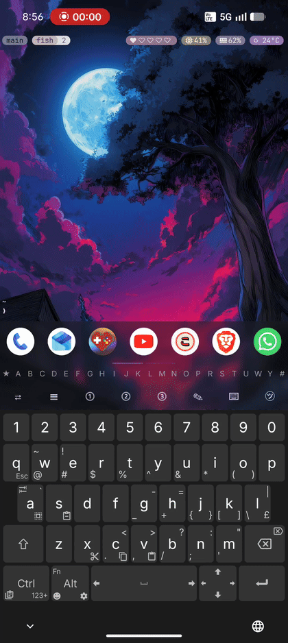
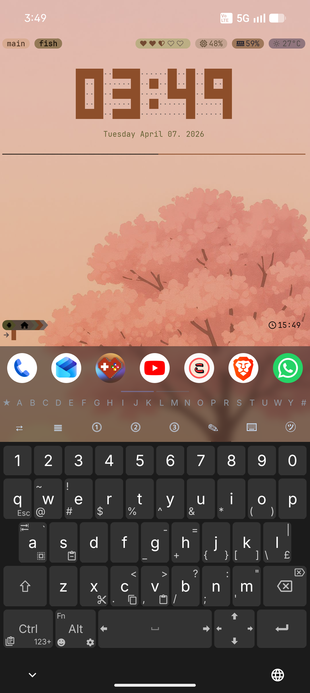
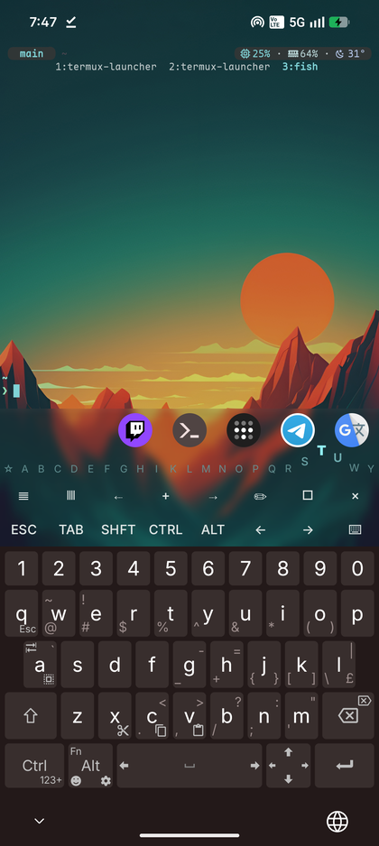
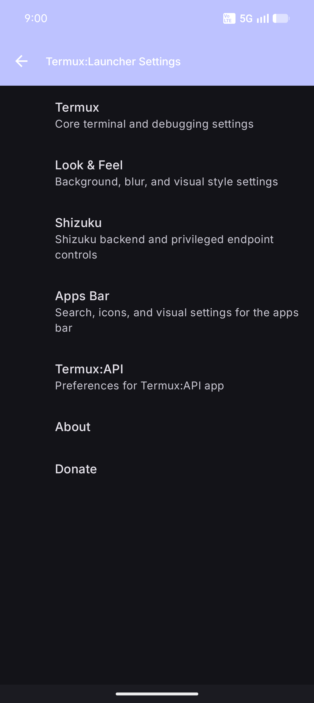
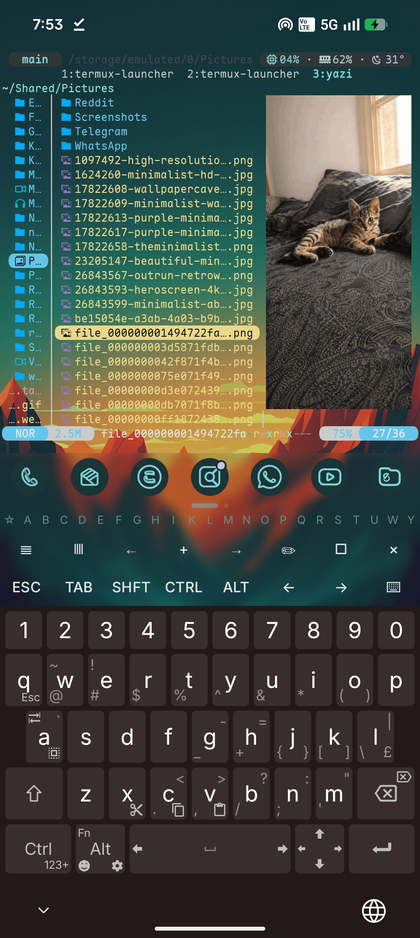

# Termux Launcher

Termux Launcher is a terminal-first Android home launcher inspired by [TEL](https://github.com/t-e-l/tel), built on [termux-app](https://github.com/termux/termux-app), with sixel-capable terminal rendering and a launcher surface integrated into the Termux session.

[Download builds](https://github.com/PickleHik3/termux-launcher/releases) | [Documentation](docs/en/index.md) | [LauncherCtl API](docs/en/LauncherCtl_API.md) | [Changelog](CHANGELOG.md)



## Why This Exists

Termux already makes Android useful as a real terminal environment. This project turns that environment into the home screen itself: the terminal stays front and center, while app launching, search, pinned apps, wallpaper-aware styling, and shell automation live around it.

It began as a TEL-style launcher with sixel image support, used pieces from [termux-monet](https://github.com/Termux-Monet/termux-monet), and was later rebased onto upstream Termux.

## Features

- Termux as the actual Android home launcher
- Pinned apps, folders, and alphabet scrub filtering for installed apps
- Terminal-driven app search with configurable split character handling
- Live app install/uninstall refresh without restarting the launcher
- Wallpaper-aware Material theming, blur controls, monochrome icons, and launcher visual tuning
- `launcherctl` shell bridge for launching apps and reading launcher/system data
- Optional Shizuku integration for screen lock and privileged status helpers

## Installation

Download the latest APK from [Releases](https://github.com/PickleHik3/termux-launcher/releases), install it, then select Termux Launcher as your Android home app.

Recommended setup:

- [Unexpected Keyboard](https://github.com/Julow/Unexpected-Keyboard) for terminal and tmux-heavy use
- [Shizuku](https://github.com/rikkaapps/shizuku) only if you want optional privileged features
- Optional [Shizuku helper examples](docs/en/Launcher_Shizuku_Examples.md) for tmux CPU/RAM/weather widgets and rish-backed `btop`
- Matching companion forks when using Termux add-ons:
  - [Termux:API](https://github.com/PickleHik3/termux-api)
  - [Termux:Styling](https://github.com/PickleHik3/termux-styling)

See [Getting Started](docs/en/Launcher_Getting_Started.md) for the setup flow.

## Documentation

- [Launcher overview](docs/en/Termux_Launcher.md)
- [Getting started](docs/en/Launcher_Getting_Started.md)
- [Using the launcher](docs/en/Launcher_Usage.md)
- [Shell integration](docs/en/Launcher_Shell_Integration.md)
- [Terminal Material colors](docs/en/Launcher_Material_Colors.md)
- [Optional Shizuku integration](docs/en/Launcher_Optional_Shizuku.md)
- [Shizuku helper examples](docs/en/Launcher_Shizuku_Examples.md)
- [LauncherCtl API](docs/en/LauncherCtl_API.md)
- [Troubleshooting](docs/en/Launcher_Troubleshooting.md)

The documentation is intentionally limited to Termux Launcher-specific usage.

## Quick Shell Example

Launch an Android app from the terminal:

```sh
launcherctl launch whatsapp
```

Example tmux binding:

```tmux
bind -n M-w run-shell 'tmux display-message "Opening WhatsApp"; launcherctl launch whatsapp >/dev/null 2>&1 || tmux display-message "Launch failed: WhatsApp"'
```

## Known Limitations

- If the terminal slows down after an app update or after the last terminal session exits, run `termux-reload-settings`.
- Opening the app from recents without setting it as the home launcher is possible, but it is less tested than normal home launcher use.

## Screenshots

<table>
  <tr>
    <td></td>
    <td></td>
  </tr>
  <tr>
    <td></td>
    <td></td>
  </tr>
</table>

## Upstream Base

- [termux-app](https://github.com/termux/termux-app)
- [termux-monet](https://github.com/Termux-Monet/termux-monet)
- [TEL](https://github.com/t-e-l/tel)
