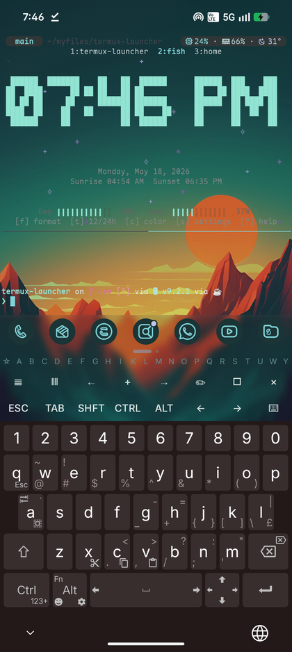
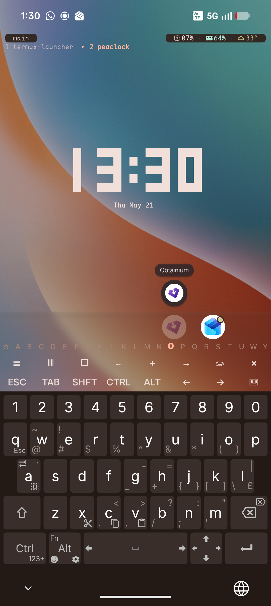
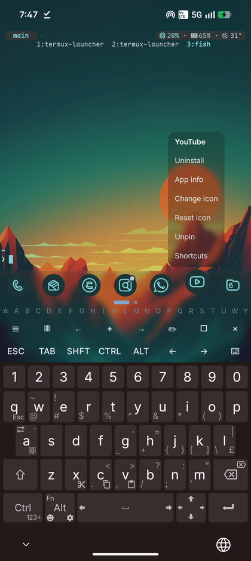

# Termux Launcher

⚠️🤖 This project is entirely vibe-coded, I have been dailying this as a launcher (nothing phone 2), its been rock solid and does not seem to affect my battery life 🤖⚠️

⚠️ The native AI backends Google/LiteRT & alibaba/MNN are highly experimental, be mindful of your device's system RAM & Processor capability when choosing models ⚠️

❗ the Termux edition (`com.termux`) cannot be installed alongside your existing termux app — use the VAJ edition (`io.vaj.tl`) for that, see [Editions](#editions) ❗
❗ if terminal slows down, run termux-reload-settings ❗

Termux Launcher is a terminal-first Android home launcher inspired by [TEL](https://github.com/t-e-l/tel), built on [termux-app](https://github.com/termux/termux-app) and [termux-monet](https://github.com/Termux-Monet/termux-monet).

**[🌐 Website & docs](https://picklehik3.github.io/termux-launcher-site/)** | [Download builds](https://github.com/PickleHik3/termux-launcher/releases) | [Getting Started](docs/en/Launcher_Getting_Started.md) | [LauncherCtl](docs/en/LauncherCtl_API.md) | [LauncherCtl MCP](docs/en/LauncherCtl_MCP.md) | [Termux AI](docs/en/Termux_AI.md) | [Changelog](CHANGELOG.md)

> **Two editions are available.** The **`com.termux`** build is the **recommended** version — it stays fully compatible with the upstream Termux package ecosystem. The **`io.vaj.tl`** build installs side-by-side with a stock Termux, but it runs off my own custom APT repository, which I maintain by hand — so it is updated manually and less often. See [Editions](#editions).


## About

Designed to be a Terminal/TUI Android home launcher.
What started out as me just wanting sixel image drawing in [TEL](https://github.com/t-e-l/tel) spiralled out of scope to what this project is today.
All credits go to the amazing developers and contributors of Termux, TEL, and Termux:Monet.

## Features

- Termux as the actual Android home launcher
- Sixel image drawing in terminal
- App dock with terminal app search
- Android Material theme integration for launcher surfaces and Termux shell theming
- `launcherctl` shell bridge for launching apps and reading launcher/system data
- On-device LLM backends using Google's LiteRT and Alibaba's MNN
- Optional Shizuku integration for screen lock and privileged status helpers

## Editions

Every release ships two APK sets. They are the same launcher built from the same source; the only difference is the Android package identity and the package ecosystem they use.

| | Termux edition | VAJ edition |
|---|---|---|
| Package name | `com.termux` | `io.vaj.tl` |
| Release tag | `vX.Y.Z` | `vX.Y.Z-vaj` |
| Alongside official Termux? | ❌ No — same package name, replaces it | ✅ Yes — installs side by side |
| Package repository | official Termux repos | VAJ APT repo (`https://repo.pathayam.xyz`) |
| Architectures | arm64-v8a, armeabi-v7a, x86_64, x86 | arm64-v8a (aarch64) only, bootstrap embedded |
| Companion add-ons | [Termux:API](https://github.com/PickleHik3/termux-api/releases) / [Termux:Styling](https://github.com/PickleHik3/termux-styling/releases) (plain tags) | same forks, `-vaj` tagged releases |

Pick the **Termux edition** if you want the launcher as your only Termux, fully compatible with the upstream Termux package ecosystem. This is the **recommended** edition for most users. Pick the **VAJ edition** if you want to keep your existing official Termux app untouched and run the launcher next to it with its own isolated prefix, data, and APT repository.

> ⚠️ The VAJ edition depends on my manually maintained custom APT repo (`https://repo.pathayam.xyz`), so its packages and `-vaj` releases are updated **less frequently** than the `com.termux` edition. If you want the most up-to-date builds and the broadest package compatibility, use the Termux (`com.termux`) edition.

In both cases, companion add-ons must be the matching builds from this project's forks (they share the launcher's signing key and package family); official F-Droid add-ons will not pair with either edition.

## Installation

Download the latest APK of your chosen [edition](#editions) from [Releases](https://github.com/PickleHik3/termux-launcher/releases), install it, then select Termux Launcher as your Android home app.

Recommended setup:

- [Unexpected Keyboard](https://github.com/Julow/Unexpected-Keyboard) for terminal and tmux-heavy use
- [Shizuku](https://github.com/rikkaapps/shizuku) only if you want optional privileged features
- Optional [termux-launcher-tmux](https://github.com/PickleHik3/termux-launcher-tmux) theme plugin, installed through the [Getting Started](docs/en/Launcher_Getting_Started.md) flow, for Material colors, CPU/RAM/weather widgets, extra keys, `kew`, and rish-backed `btop`
- Matching companion forks when using Termux add-ons (pick the release matching your [edition](#editions): plain tag for `com.termux`, `-vaj` tag for `io.vaj.tl`):
  - [Termux:API](https://github.com/PickleHik3/termux-api/releases)
  - [Termux:Styling](https://github.com/PickleHik3/termux-styling/releases)

See [Getting Started](docs/en/Launcher_Getting_Started.md) for the setup flow.

## Documentation

- [Getting Started](docs/en/Launcher_Getting_Started.md): install, launcher basics, tmux setup, rish setup, Extra Keys, and troubleshooting.
- [LauncherCtl](docs/en/LauncherCtl_API.md): shell commands, endpoint files, API basics, and permissions.
- [LauncherCtl MCP](docs/en/LauncherCtl_MCP.md): MCP client configs, tool names, and live-verified examples for local agents.
- [Termux AI](docs/en/Termux_AI.md): local model setup, `tai`, OpenAI-compatible clients, and troubleshooting.
- [Developer Docs](docs/en/Developer_Docs.md): advanced API routes, runtime notes, helper scripts, and security details.

## Quick Shell Example

Launch an Android app from the terminal:

```sh
launcherctl launch whatsapp
```

Example tmux binding:

```tmux
bind -n M-w run-shell 'tmux display-message "Opening WhatsApp"; launcherctl launch whatsapp >/dev/null 2>&1 || tmux display-message "Launch failed: WhatsApp"'
```

## Known Limitations

- When Termux is set as the home launcher and the last terminal shell exits, Android may recreate the activity before Termux can exit cleanly. Run `termux-reload-settings` if the terminal slows down or feels stale.

## Screenshots

<table>
  <tr>
    <td></td>
    <td></td>
  </tr>
  <tr>
    <td></td>
    <td></td>
  </tr>
</table>

## Upstream Base

- [termux-app](https://github.com/termux/termux-app)
- [termux-monet](https://github.com/Termux-Monet/termux-monet)
- [TEL](https://github.com/t-e-l/tel)

## License and Attributions

Termux Launcher is a modified Termux/Termux:Monet distribution, developed from 2026 onward and
released under GPLv3-only. See [LICENSE](LICENSE), [license exceptions](LICENSE-EXCEPTIONS.md), and
[open-source notices](THIRD_PARTY_NOTICES.md). The Android app exposes the same notices under
**Settings > Open-source licenses**.
