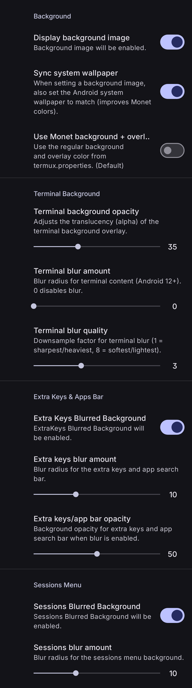
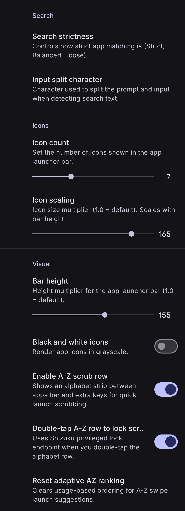

# Termux Launcher

As a long-time user of Termux Expert Launcher [TEL](https://github.com/t-e-l/tel), I wanted a version of it with sixel image drawing support inside the terminal. I am not a programmer, but I really like TUIs and keyboard-based workflows, so I set out to vibe-code a TEL-style launcher suited to my needs.

The initial idea was just to add sixel support, but it was not a straightforward task since TEL has not been updated in a while. That led me to [termux-monet](https://github.com/Termux-Monet/termux-monet), which already had sixel and iTerm-style terminal drawing, wallpaper support, and Material theming.

What followed was months of vibe coding with Codex CLI inside Termux itself. The first two weeks were frustrating, to say the least, while I figured out how to work with AI. GPT-5.3 had an annoying tendency to reduce or redefine the scope of the project without my confirmation. I think I forked `termux-monet` three times before I reached a stable base that was moving in the right direction.

The release of Codex 5.3 happened around the time I finally had the base in a working state. It is still my favorite model because it tends to just do what you ask it to.

Features were added one by one. The codebase likely has plenty of debt from all the vibe coding, but this project is still a prototype of the launcher I wanted to exist. I hope the idea is interesting enough that a real developer eventually takes it and builds it properly. Especially now, with the tools available, there is a lot of room for genuinely neat TUI experiences on Android.

That is enough background. Here is what the launcher actually is:

Termux Launcher is a terminal-first Android launcher heavily inspired by [TEL](https://github.com/t-e-l/tel). It was first forked from [termux-monet](https://github.com/Termux-Monet/termux-monet) because that project already had sixel support along with wallpaper and Material theming. After that, it was rebased onto [termux-app](https://github.com/termux/termux-app) and the sixel-related commits were pulled in from upstream.

It keeps the full Termux session front and center, and adds an apps row plus an alphabet row with the following features:

- long press for context menu
- swipe across Alphabets Row to filter apps
- from the alphabets row, you can swipe vertically upwards to choose an app which will be launched the moment you take your fingers off the screen. the vertical swipe needs to be deliberate, may need to get used to it - i may refine it in future.
- There is a pinned apps row, you can pin apps by;
  - long pressing on app icons and chosing pin.
  - long pressing on empty space in the apps row and it will give you a list of installed apps.
- you can rearrage pinned apps by;
  - long press on an app icon and move it laterally within the apps row to pick it up;
    - drop it in empty area to move
    - drop it on top of another icon to create a folder
  - note that its still a bit finnicky to move/ create folder - i recommedn for the time being you long press on empty space in apps row to rearrage/ manage pinned app icons and folders.
- you can double-tap the alphabets row to lock the phone (uses shizuku to send the lock screen key via adb so its not using android acceibility service)
- You can also use the app like normal Termux if you do not set it as your home launcher, since it still appears in the recent apps menu. That said, this mode is not well tested yet and it can cause some terminal oddities. I plan to clean that up in a future update.

[Download builds from Releases](https://github.com/PickleHik3/termux-launcher/releases)

## Highlights

- Termux as the actual home screen, not a widget inside another launcher
- Pinned app row plus alphabet scrub filtering for the full installed app list
- Live install and uninstall refresh in the app bar without restarting the launcher
- Keyboard-first search flow with configurable split character handling
- Wallpaper-aware theming, blur controls, monochrome icons, and launcher visual tuning
- Optional Shizuku hooks for screen locking and privileged status integrations

## Companion Apps

Use the matching forks below to avoid shared UID or signing mismatches:

- [Termux:API](https://github.com/PickleHik3/termux-api)
- [Termux:Styling](https://github.com/PickleHik3/termux-styling)

## Optional Shizuku Integration

Shizuku is not required for normal launcher usage.

If enabled, the current privileged integrations are limited to:

- double-tap A-Z row to lock the screen
- system stats support for tmux status bar integrations

If you use the tmux status helpers, see [tooie](https://github.com/PickleHik3/tooie).

Most of the wider Android permission surface is inherited from the upstream Termux base or kept for optional integrations. The launcher should still be treated as a normal terminal-first home launcher when Shizuku, root, or companion apps are absent.

## Setup Notes

- [Shizuku](https://github.com/rikkaapps/shizuku) is optional.
- [Unexpected Keyboard](https://github.com/Julow/Unexpected-Keyboard) is strongly recommended for tmux-heavy use.
- By default, typing `%` in the terminal starts app search in the launcher bar. This can be changed in `Settings -> Apps Bar -> Input split character`.

## Shell Launching

You can launch apps directly from the shell with `launcherctl launch`:

```sh
launcherctl launch whatsapp
```

you can also add it to tmux to launch apps using keybinds like Alt+w launches whatsapp, Example tmux binding:

```tmux
bind -n M-w run-shell 'tmux display-message "Opening WhatsApp"; launcherctl launch whatsapp >/dev/null 2>&1 || tmux display-message "Launch failed: WhatsApp"'
```

`launcherctl apps` returns the launcher's launchable activity catalog, so the shell bridge and on-screen launcher surface use the same app list.

## Development Workflow

The active development branch is `dev`. Changes should be pushed there first, then validated from the GitHub Actions debug APK artifacts because this project is not assuming a local Android SDK/NDK environment for day-to-day iteration.

The current release workflow is:

1. Make changes on `dev`.
2. Push to GitHub.
3. Run the debug APK workflow and install the artifact on-device.
4. Validate launcher behavior on-device.
5. Cut a single public release only after both hardening and polish work are validated.

See [project-docs/dev-release-workflow.md](project-docs/dev-release-workflow.md) for the checklist.

## Troubleshooting

If terminal input or screen updates become unusually slow after an app update, launcher restart, or final shell exit, run:

```sh
termux-reload-settings
```

This recreates the activity styling layer around the existing Termux session and usually clears stale terminal UI state. If the launcher itself needs a full restart, `launcherctl restart` emulates a full app close and restart.

## Demo


## Screenshots

<table>
  <tr>
    <td></td>
    <td></td>
  </tr>
  <tr>
    <td></td>
    <td></td>
  </tr>
  <tr>
    <td></td>
    <td></td>
  </tr>
  <tr>
    <td></td>
    <td></td>
  </tr>
</table>

## Known Limitations

- Android 12+ phantom process restrictions can still affect long-running Termux workloads under heavy background pressure. See [termux-app issue #2366](https://github.com/termux/termux-app/issues/2366).
- If the shell exits while the launcher is active as the system home app, Android can leave the process in a degraded state until it is restarted.

## Upstream Base

- [termux-app](https://github.com/termux/termux-app)
- [termux-monet](https://github.com/Termux-Monet/termux-monet)
- [TEL](https://github.com/t-e-l/tel)
